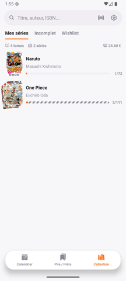
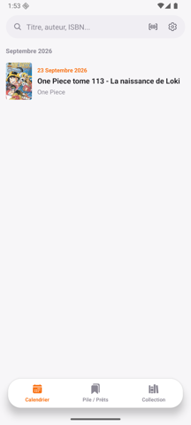
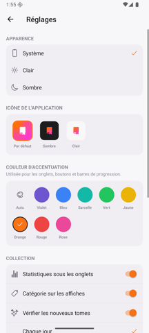
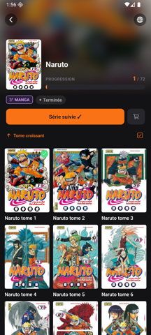

<p align="center">
  
</p>

<h1 align="center">Libory</h1>

<p align="center">
  L'appli qui garde ta bibliothèque de mangas, BD et comics sous contrôle.<br/>
  Sorties à venir, tomes possédés, prêts, wishlist — tout au même endroit.
</p>

<p align="center">
  
  
  
</p>

---

Tu suis dix séries en même temps et tu ne sais plus lequel de tes tomes est
déjà sorti, lequel tu as déjà acheté, ni à qui tu as prêté le tome 12 ?
Libory s'occupe de tout ça pour toi, hors-ligne, sans compte à créer.

## ✨ Fonctionnalités

- 🔍 **Recherche instantanée** — par titre, auteur ou ISBN, ou directement en
  scannant le code-barres au dos d'un livre.
- 📚 **Fiches complètes** — résumé, éditeur, date de sortie, nombre de pages,
  prix, note, ISBN, jusqu'à l'édition exacte que tu possèdes.
- 📅 **Calendrier des sorties** — suis une série et retrouve la date de sortie
  de son prochain tome directement dans ton calendrier.
- 🔔 **Alertes nouveaux tomes** — Libory vérifie en tâche de fond si une série
  suivie a un nouveau tome et te prévient.
- 🗂️ **Collection organisée** — onglets *Mes séries*, *Incomplet* et
  *Wishlist*, progression par série et valeur totale de ta collection
  calculée automatiquement.
- 📥 **Pile à lire & Prêts** — sépare ce que tu possèdes mais n'as pas encore
  lu de ce que tu as prêté à quelqu'un.
- 🔄 **Import Mangacollec** — déjà une collection sur Mangacollec ? Colle
  l'URL de ton profil pour tout récupérer d'un coup.
- 🎨 **Personnalisation** — thème clair, sombre ou automatique, plusieurs
  icônes d'application et couleurs d'accentuation au choix.
- 🔒 **100% local** — tes données restent sur ton téléphone (SQLite), aucun
  compte, aucun tracker.

## 📸 Aperçu

<table>
  <tr>
    <td align="center"><br/>Fiche d'une série</td>
    <td align="center"><br/>Ma collection</td>
    <td align="center"><br/>Fiche d'un tome</td>
  </tr>
  <tr>
    <td align="center"><br/>Calendrier des sorties</td>
    <td align="center"><br/>Personnalisation</td>
    <td align="center"><br/>Mode sombre</td>
  </tr>
</table>

## 📲 Télécharger

Libory est actuellement disponible pour **Android** (build direct, pas encore
sur le Play Store).

1. Va dans l'onglet [**Releases**](https://github.com/Ory-team/Libory/releases)
   du repo et télécharge le dernier `.apk`.
2. Autorise l'installation depuis une source inconnue si Android le demande.
3. Ouvre le fichier téléchargé pour installer l'app.

L'app vérifie elle-même si une nouvelle version est disponible au lancement.

---

## 🛠️ Pour les développeurs

### Stack

Expo SDK 54 · React Native 0.81 · TypeScript · React Navigation ·
TanStack Query · SQLite (`expo-sqlite`).

### Sources de données

- **Recherche** : via l'API Algolia de bubblebd.com (`src/api/bubblebd.ts`),
  pas de clé à configurer — la clé de recherche publique utilisée est celle
  que le site expose lui-même dans son bundle JS. Tous les résultats de
  l'index `Albums` sont affichés directement, sans filtre par catégorie.
- **Fiche détail** : l'index Algolia de la recherche ne renvoie qu'un
  sous-ensemble des champs (titre, auteurs, couverture, ISBN) — à l'ouverture
  d'une fiche, l'app va chercher le reste (éditeur, pages, résumé, note)
  directement sur la page de l'album (`fetchBubbleBDAlbumDetail`, JSON-LD
  `schema.org/Book`, pas de scraping HTML fragile). Une fois récupérée, la
  fiche est mise en cache et n'est plus re-scrapée. Bubblebd.com est la seule
  source de données de l'app — pas de scraping d'un autre site.
- **Import** : `src/api/mangacollec.ts` permet de récupérer la collection et
  la wishlist d'un utilisateur Mangacollec à partir de l'URL de son profil.
- **Collection** : chaque tome peut être marqué possédé, dans la pile à lire,
  prêté ou en wishlist — stocké en local (SQLite).
- **Cache** : résultats de recherche et fiches livres sont mis en cache en
  SQLite pour limiter les appels API. Les couvertures sont mises en cache
  disque via `expo-image`.

### Prérequis

- Node.js 18+
- Un JDK 17+ et le SDK Android installés localement
  (`ANDROID_HOME`/`ANDROID_SDK_ROOT`), pour le build local — voir le
  [guide Expo](https://docs.expo.dev/guides/local-app-development/).

### Développement

```bash
npm install
npm run android         # lance un build de dev et l'ouvre sur émulateur/appareil connecté
```

### Build APK Android en local (sans EAS)

```bash
./scripts/build-android.sh              # build debug
./scripts/build-android.sh --release    # build release (signé avec le keystore debug par défaut)
./scripts/build-android.sh --clean      # régénère android/ depuis zéro (après un changement d'app.json ou de dépendance native)
./scripts/build-android.sh --install    # installe l'APK sur l'appareil/émulateur connecté (adb)
```

L'APK généré se trouve dans `android/app/build/outputs/apk/<debug|release>/`.

### Mises à jour automatiques (Android)

En renseignant `EXPO_PUBLIC_UPDATE_URL` dans `.env` (URL de l'API GitHub
Releases du repo, voir `.env.example`), l'app vérifie au lancement si une
version plus récente existe et propose de la télécharger — voir
`src/store/updateFlowStore.ts`.

### Structure

```
src/
  api/
    bubblebd.ts              # recherche + détail via l'API Algolia de bubblebd.com
    mangacollec.ts            # import d'une collection/wishlist Mangacollec
  db/
    database.ts              # ouverture SQLite + migrations
    booksCache.ts             # cache des fiches livres et des résultats de recherche
    collection.ts             # CRUD des tomes possédés
    followedSeries.ts         # séries suivies (calendrier, alertes nouveaux tomes)
    loans.ts                  # tomes prêtés
    newReleasesCheck.ts        # vérification périodique des nouveaux tomes
    settings.ts               # thème, icône d'app, couleur d'accentuation
  hooks/                      # react-query hooks reliant UI <-> api/db
  navigation/                 # bottom tabs (Calendrier / Pile-Prêts / Collection) + stacks
  screens/                    # CalendarScreen, SeriesDetailScreen, BookDetailScreen, LibraryScreen, ...
  components/                 # composants UI partagés
```

## Licence

Distribué sous licence [MIT](LICENSE).
